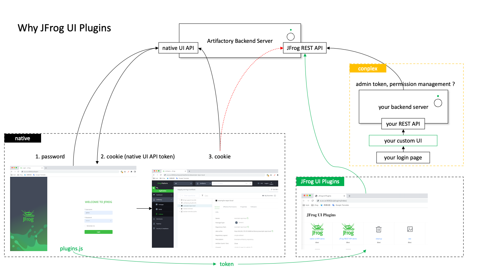
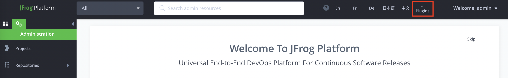
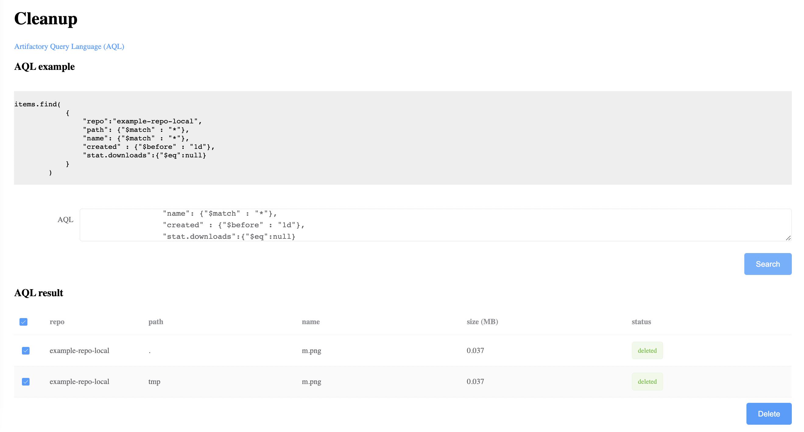

# jfrog ui plugins

- why

        1. localization / 本地化
        2. custom UI / 定制化
        3. you can imagine ...
        
        - new feature request

                - Customer would like a UI feature to delete unused or old Artifacts similar to CleanUp Plugin
                https://www.jfrog.com/jira/browse/RTFACT-26239

                - AQL GUI
                https://www.jfrog.com/jira/browse/RTFACT-8525

                - Add the Ability to Download Multiple Files at a Time via a Search
                https://www.jfrog.com/jira/browse/RTFACT-26894

                - Customer Defined Documentation
                https://www.jfrog.com/jira/browse/RTFACT-26389

                - Package Search by Build
                https://www.jfrog.com/jira/projects/JUX/issues/JUX-50

                - Providing statistics, visibility and analytics for D2D usage and security
                https://www.jfrog.com/jira/projects/JUX/issues/JUX-35

        - technical thinking

    

- how

        1. hack UI e.g. use Chinese
        2. native UI API accessible out of box (via cookie, no need to change URL)
        3. JFROG REST API accessible with builtin auth - managed access token
        4. no backend program, use your favorite html/js framework directly talking to jfrog API
        5. no users/permissions management, as permissions are consistent with your login user

- install

        1. upload plugins to Artifactory's frontend's folder
        
                e.g. /opt/jfrog/artifactory/app/frontend/bin/client/dist/plugins

        2. edit Artifactory's frontend's index.html, include plugins.js
        
                e.g. download /opt/jfrog/artifactory/app/frontend/bin/client/dist/index.html
                edit index.html, add below links
                
                <link href=/ui/plugins/plugins.js rel=preload as=script>
                 into index.html
                
                refer to index.html in this github repo to make sure position correct

        3. then upload index.html back to server
        
- plugins list

        1. login Artifactory
        2. click 'UI Plugins'

    
    

- chinese plugin

        1. login Artifactory
        2. to translate, click '中文', click 'English' to switch back to English
        3. if not willing to click manually, edit plugins.js, change code to enable auto translation

        screenshots as below

    
    

- cleanup plugin

    

        

